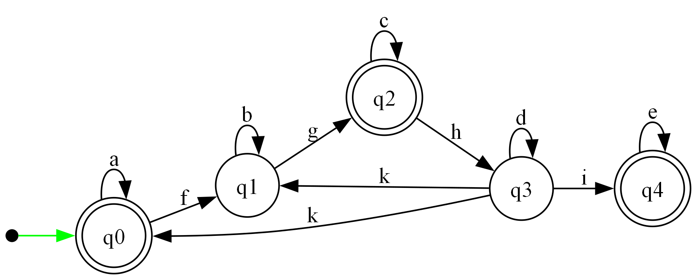

# Ô'🍅
This program is an Finite-state automaton (FSA) editor.

## Load specificaton
*All the information come from [Instruction/Projet](Instruction/Projet).*

The program need to contains the following features :
- [ ] FSA Editing, which means :
  - [ ] Adding
  - [ ] Importation/Exportation with a file
  - [ ] Editing
  - [ ] Removing
- [ ] Check if a word can be read by the FSA
- [ ] Check if an AEF is complete
- [ ] Transform an AEF into an complete AEF
- [ ] Check if an AEF is deterministic
- [ ] Transform an AEF into a deterministic one
- [ ] Do the folow operation
    - [ ] Complement of an AEF
    - [ ] Mirror of an AEF
    - [ ] Product of two AEFs
    - [ ] Concatenation of two AEFs 
- [ ] Extract a regular expression from an AEF. For example, a\*b is a regular exepression.
- [ ] Find AEF admited language. For example, {a*b} is a language
- [ ] Check if two AEF are equivalen (they recognized same language)
- [ ] Transform an AEF into an "émondé" one
- [ ] Transform an AEF into a minimal one. The new AEF will recognized the same language, with the minmal number of state. Which means that no state can be removed from the AEF and without change the know language
- [ ] The interface need to be in the shell

## Optional feature
- [ ] A GUI for editing the FSA
- [ ] Export the FSA in an image (.png, .jpg or other)

## FSA save file (.oto)
The program use the .oto extension to save your Finite-State automaton. The strucuture is the same as a CSV file with the follow header :
```
Header : Names of the state, first event, second event, thrid event, [...], EI, EF
EI: Etat Initial (0 : false, 1: true)
EF: Etat Final (0 : false, 1: true)
Note: The "Names of the state" column don't have a name in the header
```

**Example :**\
This example represent an AEF reading an binary number with an even number of 1
```
etat;a;b;c;d;e;f;g;h;i;k;EI;EF
q0;q0;nan;nan;nan;nan;q1;nan;nan;nan;nan;1;1
q1;nan;q1;nan;nan;nan;nan;q2;nan;nan;nan;0;0
q2;nan;nan;q2;nan;nan;nan;nan;q3;nan;nan;0;1
q3;nan;nan;nan;q3;nan;nan;nan;nan;q4;q0,q1;0;0
q4;nan;nan;nan;nan;q4;nan;nan;nan;nan;nan;0;1

```
We can represent this AEF with the folowing graph :\


You will find more example in [Sample/Example](Sample/Example)
